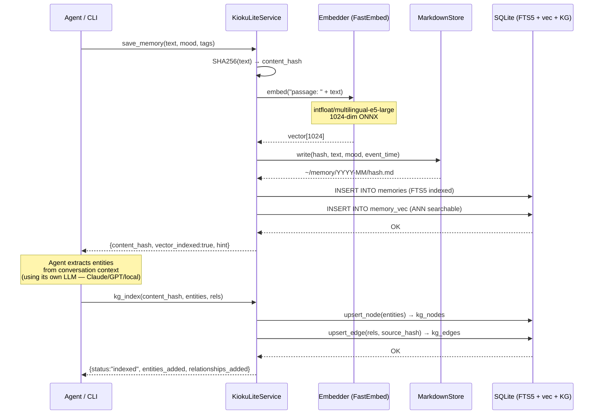

# Write Architecture — Save & KG Index


---

## Overview

The write pipeline in kioku-lite has two sequential steps performed by the agent:

1. **`save`** — stores text into 3 stores in parallel (Markdown backup + FTS5 + vector)
2. **`kg-index`** — the agent extracts entities from conversation context → indexes into the Knowledge Graph

Unlike the full kioku stack: **no LLM call** is made inside the pipeline — the agent using kioku-lite is responsible for entity extraction from its own conversation context.

---

## Pipeline

```
Agent calls: kioku-lite save "text..." --mood work
  ↓
┌──────────────────────────────────────────────┐
│  save_memory(text, mood, tags, event_time)   │
│                                              │
│  1. content_hash = SHA256(text)              │
│     (dedup key — same text won't re-save)    │
│                                              │
│  2. vector = Embedder.embed("passage: {text")│
│     FastEmbed ONNX, 1024-dim                 │
│                                              │
│  3. Write 3 stores (sequential):             │
│     ├── MarkdownStore → ~/memory/YYYY-MM/    │
│     ├── SQLiteStore   → memories (FTS5)      │
│     └── VecStore      → memory_vec (ANN)     │
└──────────────────────────────────────────────┘
  ↓
Response: {content_hash, vector_indexed, hint: "Run kg-index"}

  ↓ Agent extracts entities from conversation context
kioku-lite kg-index <content_hash> \
  --entities '[{"name":"Alice","type":"PERSON"}]' \
  --relationships '[{"source":"Alice","rel_type":"WORKS_ON","target":"Kioku"}]'
  ↓
GraphStore.upsert_node(entities) → kg_nodes
GraphStore.upsert_edge(rels, source_hash) → kg_edges
```

---

## Sequence Diagram



---

## Storage Engines

### 1. Markdown Files (Human-readable backup)
- **Path:** `~/.kioku-lite/users/<id>/memory/YYYY-MM/{hash[:8]}.md`
- **Purpose:** Fallback source of truth, human inspectable, git-trackable
- **Content:** Raw text + YAML frontmatter (mood, tags, event_time)

### 2. SQLite FTS5 (BM25 keyword search)
- **Table:** `memories` + `memory_fts` (FTS5 virtual table)
- **Primary document store:** Search results are hydrated from here via `content_hash`
- **Fields:** `content`, `mood`, `tags`, `date`, `event_time`, `content_hash`

### 3. sqlite-vec (Vector similarity)
- **Table:** `memory_vec`
- **Schema:** `content_hash TEXT PRIMARY KEY, embedding float[1024]`
- **Role:** ANN cosine similarity search

### 4. GraphStore (Knowledge Graph) — Agent-driven
- **Tables:** `kg_nodes`, `kg_edges`, `kg_aliases`
- **Populated by:** Agent calling `kg-index` after save
- **Schema:** Open — `type` and `rel_type` are plain TEXT, no fixed enum

---

## Content Hash Linking

`content_hash` (SHA256) is the universal key linking all stores:

```
Markdown file      ─── content_hash ───┐
memories row       ─── content_hash ───┤
memory_vec row     ─── content_hash ───┤
kg_edges.source_hash                ───┘
  (= content_hash of the memory containing the relationship)
```

Enables:
- **Dedup:** Same text → same hash → no re-indexing
- **Hydration:** Graph edge → `source_hash` → SQLite → full original text
- **Consistency:** All stores reference the same content

---

## KG Index — Why Agent-Driven?

| Reason | Explanation |
|--------|-------------|
| Context already available | Agent is in a conversation → no need to re-read text for extraction |
| LLM-agnostic | Works with Claude, GPT, Gemini, local models — kioku doesn't care |
| Cost control | Agent can use a cheap model for extraction, expensive model for reasoning |
| Fully offline | kioku-lite is 100% offline after the embed model is downloaded |

### Benchmark: Agent-driven vs static KG

| KG Method | P@3 | R@5 |
|---|---|---|
| Pre-defined (static) | 0.40 | 0.75 |
| Claude Haiku extraction | **0.60** | **0.89** |

Agent-driven extraction improves recall by ~50% vs pre-defined entities.

---

## Entity & Relationship Types

**Open schema** — any string is valid. See [04-kg-open-schema.md](04-kg-open-schema.md) for details.

Recommended defaults:

| Entity Types | Relationship Types |
|---|---|
| `PERSON`, `ORGANIZATION`, `PLACE` | `KNOWS`, `WORKS_AT`, `LOCATED_AT` |
| `PROJECT`, `TOOL`, `CONCEPT` | `WORKS_ON`, `USED_BY`, `CONTRIBUTES_TO` |
| `EVENT`, `BOOK`, `SKILL` | `INVOLVES`, `AUTHORED_BY`, `LEARNING` |

---

## E5 Embedding Prefix

Model `intfloat/multilingual-e5-large` requires instruction prefixes:

| Operation | Prefix |
|---|---|
| Indexing (`save`) | `passage: {text}` |
| Querying (`search`) | `query: {text}` |

Applied automatically inside `FastEmbedder` / `OllamaEmbedder`.

---

## Graceful Degradation

| Component | State | Impact |
|---|---|---|
| FastEmbed / ONNX | Unavailable | `vector_indexed: false`, BM25 + KG still work |
| sqlite-vec | Missing | Semantic search skipped, BM25 + KG still work |
| GraphStore | Error | kg-index fails, search still uses BM25 + Vector |
| SQLite | ❌ | Critical failure, no fallback |
