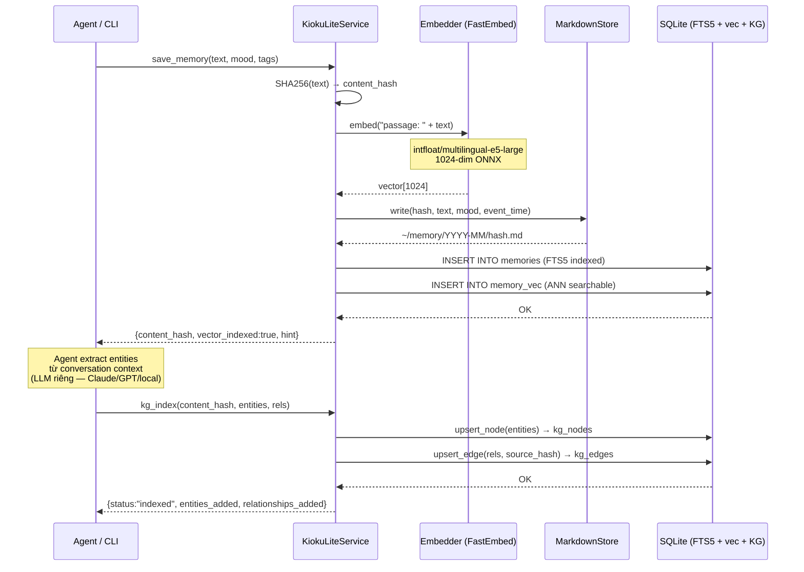

# Write Architecture — Save & KG Index

> Last updated: 2026-02-28 (v0.1.14)

---

## Overview

Write pipeline trong kioku-lite gồm 2 bước liên tiếp do agent thực hiện:

1. **`save`** — lưu text vào 3 stores song song (Markdown backup + FTS5 + vector)
2. **`kg-index`** — agent tự extract entities → index vào Knowledge Graph

Khác với kioku full: **không có LLM call** trong pipeline — agent đang dùng kioku-lite chịu trách nhiệm extract entities từ conversation context của chính nó.

---

## Pipeline tổng thể

```
Agent gọi: kioku-lite save "text..." --mood work
  ↓
┌──────────────────────────────────────────────┐
│  save_memory(text, mood, tags, event_time)   │
│                                              │
│  1. content_hash = SHA256(text)              │
│     (dedup key — same text không save lại)   │
│                                              │
│  2. vector = Embedder.embed("passage: {text")│
│     FastEmbed ONNX, 1024-dim                 │
│                                              │
│  3. Write 3 stores (sequential):             │
│     ├── MarkdownStore → ~/memory/YYYY-MM/    │
│     ├── SQLiteStore   → memories (FTS5)      │
│     └── VecStore      → memory_vec (ANN)     │
└──────────────────────────────────────────────┘
  ↓
Response: {content_hash, vector_indexed, hint: "Run kg-index"}

  ↓ Agent tự extract entities từ conversation context
kioku-lite kg-index <content_hash> \
  --entities '[{"name":"Hùng","type":"PERSON"}]' \
  --relationships '[{"source":"Hùng","rel_type":"WORKS_ON","target":"Kioku"}]'
  ↓
GraphStore.upsert_node(entities) → kg_nodes
GraphStore.upsert_edge(rels, source_hash) → kg_edges
```

---

## Sequence Diagram



---

## Storage Engines

### 1. Markdown Files (Human-readable backup)
- **Path:** `~/.kioku-lite/users/<id>/memory/YYYY-MM/{hash[:8]}.md`
- **Purpose:** Source-of-truth dự phòng, human inspectable, git-trackable
- **Content:** Raw text + YAML frontmatter (mood, tags, event_time)

### 2. SQLite FTS5 (BM25 keyword search)
- **Table:** `memories` + `memory_fts` (FTS5 virtual table)
- **Primary document store:** Search results được hydrate từ đây qua `content_hash`
- **Fields:** `content`, `mood`, `tags`, `date`, `event_time`, `content_hash`

### 3. sqlite-vec (Vector similarity)
- **Table:** `memory_vec`
- **Schema:** `content_hash TEXT PRIMARY KEY, embedding float[1024]`
- **Role:** ANN cosine similarity search

### 4. GraphStore (Knowledge Graph) — Agent-driven
- **Tables:** `kg_nodes`, `kg_edges`, `kg_aliases`
- **Populated by:** Agent gọi `kg-index` sau save
- **Schema:** Open — `type` và `rel_type` là plain TEXT, không enum cố định

---

## Content Hash Linking

`content_hash` (SHA256) là universal key liên kết tất cả stores:

```
Markdown file      ─── content_hash ───┐
memories row       ─── content_hash ───┤
memory_vec row     ─── content_hash ───┤
kg_edges.source_hash                ───┘
  (= content_hash của memory chứa relationship)
```

Cho phép:
- **Dedup:** Same text → same hash → không index lại
- **Hydration:** Graph edge → `source_hash` → SQLite → full original text
- **Consistency:** Mọi store reference cùng content

---

## KG Index — Tại sao Agent-Driven?

| Reason | Giải thích |
|--------|-----------|
| Context đã có | Agent đang hội thoại → không cần re-read text để extract |
| LLM-agnostic | Dùng Claude, GPT, Gemini, local model — kioku không quan tâm |
| Cost control | Agent chọn cheap model để extract, expensive model cho reasoning |
| Fully offline | kioku-lite 100% offline sau khi embed model download |

### Benchmark: Agent-driven vs static KG

| KG Method | P@3 | R@5 |
|---|---|---|
| Pre-defined (static) | 0.40 | 0.75 |
| Claude Haiku extraction | **0.60** | **0.89** |

Agent-driven tăng 50% recall so với pre-defined entities.

---

## Entity & Relationship Types

**Open schema** — bất kỳ string nào đều hợp lệ. Xem [05-kg-open-schema.md](05-kg-open-schema.md) để biết chi tiết.

Recommended defaults:

| Entity Types | Relationship Types |
|---|---|
| `PERSON`, `ORGANIZATION`, `PLACE` | `KNOWS`, `WORKS_AT`, `LOCATED_AT` |
| `PROJECT`, `TOOL`, `CONCEPT` | `WORKS_ON`, `USED_BY`, `CONTRIBUTES_TO` |
| `EVENT`, `BOOK`, `SKILL` | `INVOLVES`, `AUTHORED_BY`, `LEARNING` |

---

## E5 Embedding Prefix

Model `intfloat/multilingual-e5-large` yêu cầu instruction prefix:

| Operation | Prefix |
|---|---|
| Indexing (`save`) | `passage: {text}` |
| Querying (`search`) | `query: {text}` |

Được apply tự động trong `FastEmbedder` / `OllamaEmbedder`.

---

## Graceful Degradation

| Component | Trạng thái | Impact |
|---|---|---|
| FastEmbed / ONNX | Unavailable | `vector_indexed: false`, BM25 + KG vẫn hoạt động |
| sqlite-vec | Missing | Semantic search skip, BM25 + KG vẫn hoạt động |
| GraphStore | Error | kg-index fail, search vẫn BM25 + Vector |
| SQLite | ❌ | Critical failure, không fallback |
