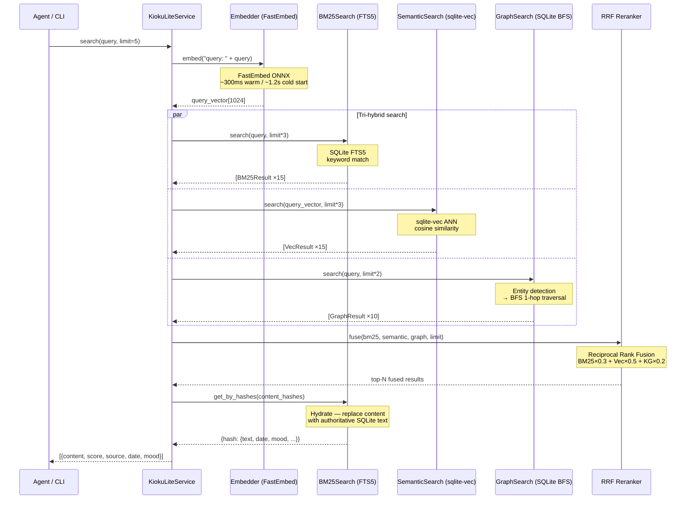

# Search Architecture — How It Works

> Last updated: 2026-02-27 (v0.1.0)

## Overview

`search` là retrieval pipeline của kioku-lite — tri-hybrid search kết hợp BM25, vector similarity, và knowledge graph traversal, không cần LLM call trong search path.

## Pipeline

```
kioku-lite search "Hùng làm gì hôm nay" --limit 5
  ↓
┌──────────────────────────────────────────────┐
│  search(query, limit)                        │
│                                              │
│  1. Embed Query                              │
│     └── embed("query: " + text)             │
│         → 1024-dim query vector              │
│                                              │
│  2. Tri-Hybrid Search (parallel)             │
│     ├── BM25 (SQLite FTS5)                   │
│     │   keywords extracted from query        │
│     ├── Semantic (sqlite-vec)                │
│     │   cosine similarity → query vector     │
│     └── Graph (SQLite BFS)                   │
│         entity names detected in query       │
│         → BFS 1-hop neighbors                │
│                                              │
│  3. RRF Reranking                            │
│     └── Reciprocal Rank Fusion               │
│         weights: BM25×0.3 + Vec×0.5 + KG×0.2│
│                                              │
│  4. Deduplicate + Hydrate                    │
│     └── Fetch full text from SQLite          │
└──────────────────────────────────────────────┘
  ↓
[{content, score, source, date, mood, content_hash}, ...]
```

## Sequence Diagram



## Response Structure

```json
{
  "query": "Hùng làm gì hôm nay",
  "count": 3,
  "results": [
    {
      "content": "Gặp Hùng ở cà phê, bàn về kế hoạch release kioku-lite.",
      "score": 0.032,
      "source": "graph",
      "date": "2026-02-27",
      "mood": "excited",
      "content_hash": "abc123..."
    },
    {
      "content": "Hôm nay họp với Hùng về dự án Kioku. Rất productive.",
      "score": 0.018,
      "source": "vector",
      "date": "2026-02-27",
      "mood": "work",
      "content_hash": "def456..."
    }
  ]
}
```

## Component Roles

### BM25 (SQLite FTS5)
- **Strength:** Exact keyword / entity name matching
- **Query format:** Tên entities được wrap trong `"..."` để tránh FTS5 syntax errors
- **Weight in RRF:** 0.30
- **Observed contribution:** ~30% — đặc biệt mạnh với tên riêng, kỹ thuật terms

### Semantic (sqlite-vec)
- **Strength:** Fuzzy semantics, synonyms, cross-language
- **Model:** `intfloat/multilingual-e5-large` (E5 `query:` prefix)
- **ANN method:** Cosine similarity scan (sqlite-vec)
- **Weight in RRF:** 0.50
- **Observed contribution:** ~50% — dominant cho conceptual queries

### Graph (SQLite BFS)
- **Strength:** Relationship discovery, entity-linked memories
- **Method:** Detect entity names in query → BFS 1-hop in kg_relations
- **Weight in RRF:** 0.20
- **Observed contribution:** ~20% — critical cho person/project queries

## RRF Reranking

Reciprocal Rank Fusion formula:

```
score(d) = Σ  weight_leg × 1 / (k + rank_in_leg(d))
           legs
```

Where `k = 60` (standard RRF constant).

Results are merged, deduplicated by `content_hash`, then sorted by fused score descending.

## Latency Breakdown (10-query benchmark)

| Phase | Time | Notes |
|---|---|---|
| FastEmbed embed query | ~300ms (warm) / ~1,200ms (cold) | ONNX model load penalty |
| BM25 FTS5 search | ~5ms | In-process SQLite |
| sqlite-vec ANN | ~50ms | In-process |
| GraphSearch BFS | ~10ms | In-process SQLite |
| RRF + hydrate | ~20ms | In-process |
| **Total (warm)** | **~400ms** | Long-running service |
| **Total (cold CLI)** | **~1,200ms** | Subprocess + model load |

> **Note:** Cold start penalty (~800ms) từ subprocess Python initialization và ONNX model load. Với service long-running (e.g. MCP server), warm latency ~400ms.

## Real-World Performance (2026-02-27 Benchmark)

Benchmark so sánh với kioku-agent-kit (full) — cùng corpus 20 docs, 10 queries, cùng model:

| Metric | kioku-lite | kioku full |
|---|---|---|
| Avg search latency | **1,210ms** | 9,176ms (throttled) / ~2,500ms normal |
| Precision@3 | **0.60** | 0.60 |
| Recall@5 | 0.89 | **1.04** |
| Queries won | **6/10** | 2/10 |

**kioku-lite thắng:** Technical term queries (debug, merge PR, deploy) — BM25 FTS5 chính xác hơn.  
**kioku full thắng:** Complex semantic + multi-entity queries — ChromaDB ANN + FalkorDB multi-hop.

Chi tiết: [benchmark.md](../benchmark.md)
