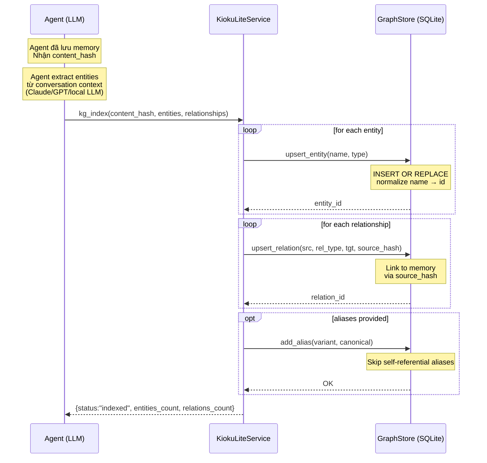

# KG Index Architecture — Agent-Driven Knowledge Graph

> Last updated: 2026-02-27 (v0.1.0)

## Overview

`kg-index` là điểm khác biệt cốt lõi giữa kioku-lite và kioku full. Thay vì tự gọi LLM để extract entities, kioku-lite **ủy thác hoàn toàn** việc này cho agent đang sử dụng nó.

**Lý do thiết kế này:**
1. Agent (Claude Code, OpenClaw,...) đã có context về cuộc hội thoại — không cần re-extract
2. Tách biệt memory store khỏi LLM dependency → có thể dùng bất kỳ LLM nào
3. Agent có thể chọn quality vs cost của extraction (cheap model vs expensive model)
4. kioku-lite hoàn toàn offline sau khi embed model đã download

## Pipeline

```
1. Agent đã gọi save → nhận content_hash
   ────────────────────────────────────────

2. Agent tự extract entities từ conversation context:
   (dùng LLM của chính agent — Claude, GPT, Gemini,...)

   entities = [
     {"name": "Hùng",  "type": "PERSON"},
     {"name": "Kioku", "type": "PROJECT"},
   ]
   relationships = [
     {"source": "Hùng", "rel_type": "WORKS_ON", "target": "Kioku"}
   ]

3. Agent gọi kg-index:
   ───────────────────────────────────────────────────────────
   kioku-lite kg-index <content_hash>                        \
     --entities     '[{"name":"Hùng","type":"PERSON"}]'      \
     --relationships '[{"source":"Hùng","rel_type":"WORKS_ON","target":"Kioku"}]'
   ────────────────────────────────────────────────────────────
         ↓
   KiokuLiteService.kg_index()
         ↓
   GraphStore.upsert_entities(entities)    → kg_entities table
   GraphStore.upsert_relations(rels, hash) → kg_relations table
   GraphStore.add_alias(variants)          → kg_aliases table
```

## Sequence Diagram



## Database Schema

```sql
-- Named entities
CREATE TABLE kg_entities (
    id          TEXT PRIMARY KEY,   -- normalized: lowercase, stripped
    name        TEXT NOT NULL,      -- display name (original case)
    entity_type TEXT,               -- PERSON | PROJECT | PLACE | TOOL | CONCEPT
    user_id     TEXT NOT NULL,
    created_at  TEXT
);

-- Typed relationships between entities
CREATE TABLE kg_relations (
    id          TEXT PRIMARY KEY,   -- UUID
    source_id   TEXT NOT NULL REFERENCES kg_entities(id),
    target_id   TEXT NOT NULL REFERENCES kg_entities(id),
    rel_type    TEXT NOT NULL,      -- WORKS_ON | KNOWS | USED_BY | CONTRIBUTED_TO | ...
    source_hash TEXT,               -- content_hash của memory chứa relationship
    user_id     TEXT NOT NULL,
    created_at  TEXT
);

-- Entity name variants → canonical form
CREATE TABLE kg_aliases (
    alias_id    TEXT NOT NULL REFERENCES kg_entities(id),
    canonical_id TEXT NOT NULL REFERENCES kg_entities(id),
    user_id     TEXT NOT NULL,
    PRIMARY KEY (alias_id, canonical_id, user_id),
    CHECK (alias_id != canonical_id)  -- no self-referential aliases
);
```

## Entity Types (Recommended)

| Type | Examples |
|---|---|
| `PERSON` | Hùng, Lan, Minh, Cal Newport |
| `PROJECT` | Kioku, kioku-lite |
| `PLACE` | Hồ Tây, Đà Lạt, văn phòng |
| `TOOL` | ChromaDB, FalkorDB, sqlite-vec |
| `CONCEPT` | machine learning, knowledge graph |

## Relationship Types (Recommended)

| Type | Meaning |
|---|---|
| `KNOWS` | Người A quen người B |
| `WORKS_ON` | Ai đó làm việc với project |
| `CONTRIBUTED_TO` | Ai đó đóng góp cho project |
| `USED_BY` | Tool được dùng bởi project |
| `LOCATED_AT` | Entity ở địa điểm |
| `MENTIONS` | Generic relation |

## Graph Search (BFS)

Khi search, GraphSearch detect entity names trong query → BFS 1-hop:

```python
# Tìm tất cả memories liên quan đến entity "Hùng"
SELECT DISTINCT m.*
FROM kg_relations r
JOIN kg_entities src ON r.source_id = src.id
JOIN kg_entities tgt ON r.target_id = tgt.id
WHERE src.name LIKE '%Hùng%' OR tgt.name LIKE '%Hùng%'
```

Kết quả được merge vào RRF pipeline với weight 0.20.

## Benchmark: Claude vs Pre-defined KG

| KG Method | P@3 | R@5 | Notes |
|---|---|---|---|
| Pre-defined (ground-truth) | 0.40 | 0.75 | Tốt nhưng không thực tế |
| Claude Haiku extraction | **0.60** | **0.89** | Tương đương kioku full |

Agent-driven KG với Claude Haiku cho chất lượng search **tăng 50%** so với pre-defined static entities.

## Prompt Mẫu cho Agent

Khi agent gọi `kg-index`, cần extract entities từ text. Prompt mẫu:

```
Extract entities and relationships from this Vietnamese diary entry.

Text: "{text}"

Return JSON only:
{
  "entities": [{"name": "...", "type": "PERSON|PROJECT|PLACE|TOOL|CONCEPT"}],
  "relationships": [{"source": "...", "rel_type": "KNOWS|WORKS_ON|USED_BY|...", "target": "..."}]
}

Rules:
- Only clearly mentioned entities (names, projects, places, tools)
- Skip generic words: "team", "mình", "tôi", "họ"
- Only relationships between explicitly mentioned entity pairs
- If nothing clear: {"entities": [], "relationships": []}
```
