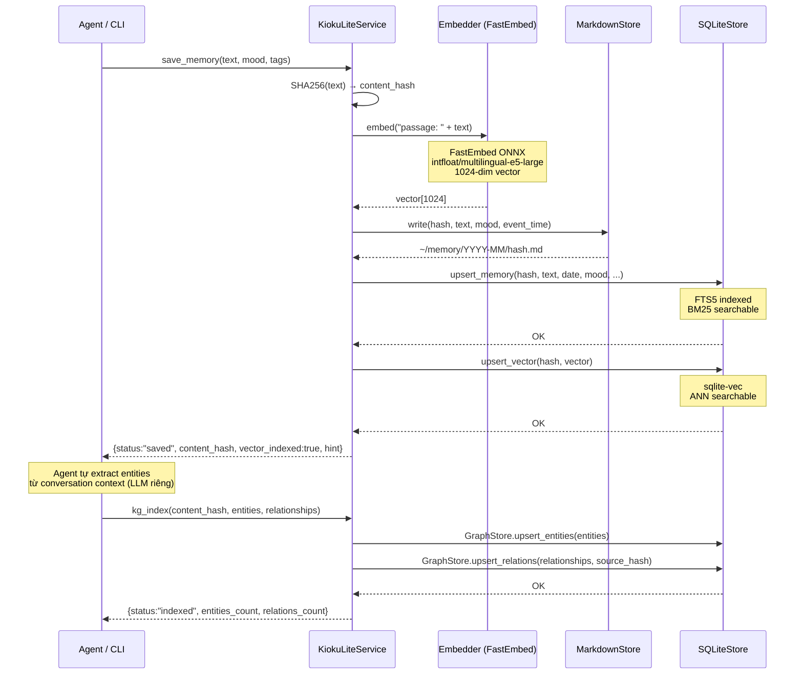

# Save Architecture — How It Works

> Last updated: 2026-02-27 (v0.1.0)

## Overview

`save_memory` là ingestion pipeline của kioku-lite. Khác với kioku full, **không có LLM call** trong pipeline này — agent chịu trách nhiệm extract entities và gọi `kg-index` riêng.

## Pipeline

```
Agent gọi: kioku-lite save "text..." --mood work
  ↓
┌──────────────────────────────────────────────┐
│  save_memory(text, mood, tags, event_time)   │
│                                              │
│  1. Content Hash                             │
│     └── SHA256(text) → content_hash          │
│         (dedup key, idempotent)              │
│                                              │
│  2. Embed                                    │
│     └── Embedder.embed("passage: " + text)  │
│         → 1024-dim vector (FastEmbed ONNX)  │
│                                              │
│  3. Write 3 stores (sequential):             │
│     ├── MarkdownStore                        │
│     │   └── ~/memory/YYYY-MM/hash.md         │
│     ├── SQLiteStore.upsert_memory            │
│     │   └── memories table (FTS5 indexed)   │
│     └── SQLiteStore.upsert_vector            │
│         └── vec_memories (sqlite-vec)        │
└──────────────────────────────────────────────┘
  ↓
Response: {status, content_hash, date, mood, vector_indexed, hint}
hint: "Run `kg-index` to add knowledge graph entries"

  ↓ (Optional — agent's responsibility)
kioku-lite kg-index <content_hash> \
  --entities '[{"name":"Hùng","type":"PERSON"}]' \
  --relationships '[{"source":"Hùng","rel_type":"WORKS_ON","target":"Kioku"}]'
```

## Sequence Diagram



## Storage Engines

### 1. Markdown Files (Human-readable backup)
- **Path:** `~/.kioku-lite/memory/YYYY-MM/{content_hash[:8]}.md`
- **Purpose:** Human-readable, git-trackable, không phụ thuộc SQLite
- **Content:** Raw text + metadata frontmatter

### 2. SQLite FTS5 (BM25 keyword search)
- **Table:** `memories` + `memories_fts` (FTS5 virtual table)
- **Fields:** `content`, `mood`, `tags`, `date`, `event_time`, `content_hash`
- **Role:** Primary document store — tất cả search results được hydrate từ đây

### 3. sqlite-vec (Vector search)
- **Table:** `vec_memories` (sqlite-vec virtual table)
- **Schema:** `content_hash TEXT PRIMARY KEY, embedding float[1024]`
- **Role:** ANN cosine similarity search

### 4. GraphStore (Knowledge Graph) — *Agent-driven*
- **Tables:** `kg_entities`, `kg_relations`, `kg_aliases`
- **Populated by:** Agent gọi `kg-index` sau khi save

## Content Hash Linking

`content_hash` (SHA256) là universal key liên kết tất cả stores:

```
Markdown file       ─── content_hash ───┐
SQLite memories row ─── content_hash ───┤
vec_memories row    ─── content_hash ───┤
kg_relations row    ─── source_hash  ───┘
          (= content_hash của memory chứa relationship)
```

Điều này cho phép:
- **Deduplication:** Same text sẽ không index lại lần 2
- **Cross-store hydration:** Graph edge → source_hash → SQLite → full text
- **Consistency:** Mọi store đều reference cùng content

## E5 Embedding Prefix

Model `intfloat/multilingual-e5-large` dùng instruction prefix:

| Operation | Prefix |
|---|---|
| Indexing (save) | `passage: {text}` |
| Querying (search) | `query: {text}` |

Prefix được apply tự động trong FastEmbedder/OllamaEmbedder.

## Graceful Degradation

| Component | Down | Impact |
|---|---|---|
| FastEmbed / ONNX | Unavailable | `vector_indexed: false`, BM25 + KG vẫn hoạt động |
| sqlite-vec extension | Missing | Vector table không tạo, semantic search skip |
| GraphStore | Error | kg-index fail, search vẫn BM25 + Vector |
| SQLite | ❌ | Critical failure, không fallback |
