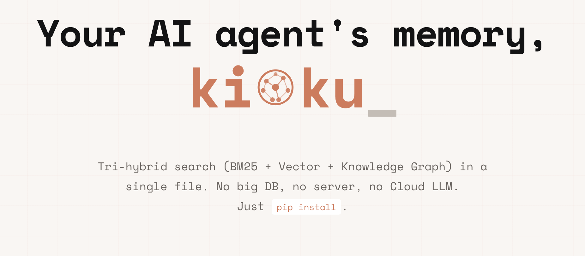

# Kioku: Tại sao tôi tự build một bộ nhớ có Knowledge Graph cho AI agent của mình

Chào anh em builder và cộng đồng open-source!

Hôm nay mình muốn giới thiệu một side-project mà mình đã ấp ủ và phát triển để giải quyết một pain point rất cá nhân nhưng mình tin là nhiều anh em ở đây cũng gặp phải: **Làm sao để AI thực sự có một "trí nhớ dài hạn" hiểu được cảm xúc và quan hệ nhân quả của chúng ta?**

Đó là lý do **Kioku** ra đời. Đây là một Personal Memory Engine siêu nhẹ, chạy hoàn toàn local, được thiết kế chuyên biệt cho AI Agent.


*Trang chủ: [phuc-nt.github.io/kioku-lite-landing](https://phuc-nt.github.io/kioku-lite-landing/)*

## Ý tưởng ban đầu: Nỗi đau của người thích viết nhật ký

Mình vốn là một người có thói quen viết nhật ký hàng ngày. Mình thích "phản tỉnh" (self-reflect) và nhìn nhận lại bản thân dựa trên những sự kiện đã qua. Trong thời đại AI bùng nổ, mình đã thử dùng rất nhiều công cụ và chat bot để làm việc này, nhưng kết quả luôn gây thất vọng.

Vấn đề lớn nhất là: **Chưa có tool nào thực sự giải quyết tốt việc lưu trữ, phân tích cảm xúc và hiểu được mối quan hệ nhân quả của các hành động.**

Các agent phổ biến hiện nay (kể cả những cái tên đình đám) dù có tính năng "long-term memory", nhưng bản chất chỉ là lưu lại một mớ text dẹt (flat text) hoặc vector nhét vào context window. Khi bạn hỏi *"Tại sao đợt trước tôi lại stress về dự án X?"*, hệ thống thường bối rối vì nó không móc nối được sự kiện A (cãi nhau với sếp) dẫn đến cảm xúc B (stress) và quyết định C (đổi dự án). Nó thiếu đi tính **kết nối**.

## Giải pháp: Một engine memory mở cho mọi agent

Là một người thường xuyên sử dụng AI tool, đặc biệt là các coding agent (như Claude Code, Windsurf, Cursor), mình nhận ra: Thay vì tự build một con bot mới từ đầu, tại sao không tạo ra một *cơ quan trí nhớ* độc lập để "gắn" vào các agent yêu thích của chúng ta?

Mục tiêu là tool này phải **dùng được cho đa dạng agent nhất có thể**. Đó là lý do mình chọn cho phiên bản lite (kioku-lite) kiến trúc giao tiếp qua **CLI** và **SKILLS file** (cụ thể là định dạng `AGENTS.md` & `SKILL.md` đang rất phổ biến hiện nay của dòng CLI Agent). Chỉ bằng vài dòng lệnh, agent có thể học cách gọi CLI để đọc/ghi ký ức.

## Kiến trúc ngắn gọn: Write, search và so sánh

Kioku Lite sử dụng cơ chế tìm kiếm **Tri-hybrid** (3 mũi nhọn) chạy 100% trên SQLite:
1. **BM25 (FTS5):** Tìm kiếm từ khóa chính xác.
2. **Vector (sqlite-vec + FastEmbed ONNX):** Tìm kiếm ngữ nghĩa (chạy local, không cần API).
3. **Knowledge Graph (GraphStore):** Lưu đồ thị thực thể và các mối quan hệ nhân quả.

Dưới đây là mô hình tổng quan hệ thống:

```
┌──────────────────────────────────────────────────────────────┐
│                     INTERFACE LAYER                          │
│                                                              │
│   ┌───────────────────────────────────────────────────────┐  │
│   │  cli.py  (Typer CLI)                                  │  │
│   │  • save       • kg-index    • kg-alias               │  │
│   │  • search     • recall      • connect                │  │
│   │  • entities   • timeline    • users    • setup       │  │
│   │  • init       • install-profile                      │  │
│   └──────────────────────────┬────────────────────────────┘  │
│                              │                               │
└──────────────────────────────┼───────────────────────────────┘
                               ▼
┌──────────────────────────────────────────────────────────────┐
│               KiokuLiteService  (service.py)                 │
│   save_memory() │ search() │ kg_index() │ delete_memory()   │
└────────┬─────────────────┬─────────────────────┬─────────────┘
         │                 │                     │
         ▼                 ▼                     ▼
  MarkdownStore        Embedder              KiokuDB
  ~/memory/*.md       FastEmbed             (single .db)
  (human backup)      ONNX local    ┌────────────────────────┐
                                    │  SQLiteStore           │
                                    │  ├── memories (FTS5)   │
                                    │  └── memory_vec        │
                                    │      (sqlite-vec)      │
                                    │                        │
                                    │  GraphStore            │
                                    │  ├── kg_nodes          │
                                    │  ├── kg_edges          │
                                    │  └── kg_aliases        │
                                    └────────────────────────┘
```

Giao thức này chia làm 2 phase chính do Agent tự điều phối:

### 1. Write phase
Khi có sự kiện mới: Agent lưu text (`save`) sau đó tự trích xuất thực thể/mối quan hệ rồi lập chỉ mục vào Graph (`kg-index`). Toàn bộ quá trình xảy ra local, không có call ngầm tới LLM.

### 2. Search phase
Khi cần bối cảnh: Agent gọi `search`. Kết quả tìm kiếm sẽ đi qua 3 luồng riêng biệt và kết hợp lại qua cơ chế RRF (Reciprocal Rank Fusion):

```
┌──────────────────────────────────────────────────────────────┐
│                  kioku-lite search "query"                   │
└──────────────────────────────┬───────────────────────────────┘
                               ▼
┌──────────────────────────────────────────────────────────────┐
│           1. Embed Query (FastEmbed 1024-dim ONNX)           │
└──────────────────────────────┬───────────────────────────────┘
                               ▼
┌──────────────────────────────────────────────────────────────┐
│                 2. Tri-hybrid Search Engines                 │
│                                                              │
│  ┌────────────────┐  ┌────────────────┐  ┌────────────────┐  │
│  │   BM25 Search  │  │ Semantic Search│  │  Graph Search  │  │
│  │ (SQLite FTS5)  │  │  (sqlite-vec)  │  │  (SQLite BFS)  │  │
│  └───────┬────────┘  └───────┬────────┘  └───────┬────────┘  │
└──────────┼───────────────────┼───────────────────┼───────────┘
           │                   │                   │
           ▼                   ▼                   ▼
┌──────────────────────────────────────────────────────────────┐
│    3. Reciprocal Rank Fusion (RRF) & Deduplication           │
└──────────────────────────────┬───────────────────────────────┘
                               ▼
┌──────────────────────────────────────────────────────────────┐
│                    Final Merged Results                      │
└──────────────────────────────────────────────────────────────┘
```

### So sánh Memory Models

Thường thì anh em dùng Claude Code hay OpenClaw sẽ thắc mắc memory có gì khác biệt. Đây là bảng so sánh nhanh:

| System | Memory Model | Persistence | Search | Knowledge Graph |
|---|---|---|---|---|
| **Claude Code** | Flat markdown files | Session-scoped + `CLAUDE.md` / `MEMORY.md` | None (context window only) | Không |
| **OpenClaw** | SQLite chunks + embeddings | Per-agent SQLite database | Semantic (embedding-based) | Không |
| **Kioku Lite** | SQLite + Markdown + KG | Per-profile isolated stores | Tri-hybrid (BM25 + vector + KG) | Có (Agent-driven) |

*(Đọc thêm chi tiết tại trang tài liệu chính thức: [System Architecture](https://phuc-nt.github.io/kioku-lite-landing/blog.html#system-architecture) | [Write/Save/KG-Index](https://phuc-nt.github.io/kioku-lite-landing/blog.html#write-save-kg-index) | [Search Architecture](https://phuc-nt.github.io/kioku-lite-landing/blog.html#search-architecture) | [Memory Comparison](https://phuc-nt.github.io/kioku-lite-landing/blog.html#memory-comparison))*

## Knowledge Graph (KG): Chìa khóa của tính linh hoạt

Một điểm mạnh khác của Kioku Lite là **Open Schema** cho Knowledge Graph. 
Các loại thực thể (`entity_type`) và quan hệ (`rel_type`) là các chuỗi string linh hoạt, không bị gò bó trong các enum cố định. 

Trong bộ cài đặt của kioku-lite đã có sẵn **2 persona mặc định**:
- **Companion**: Agent extract các node `EMOTION`, `LIFE_EVENT` và nối chúng bằng `TRIGGERED_BY`. Phù hợp cho việc ghi nhật ký và theo dõi cảm xúc.
- **Mentor**: Agent extract `DECISION`, `LESSON` và quan hệ `LED_TO`. Phù hợp cho việc phản tỉnh và rút kinh nghiệm.

Ngoài ra, bạn hoàn toàn có thể nhờ agent của mình cấu hình thêm persona mới theo nhu cầu riêng, ví dụ: quản lý nhân sự, quản lý sản phẩm, hoặc bất kỳ lĩnh vực nào bạn muốn agent ghi nhớ theo cách riêng.

*(Chi tiết về schema: [KG Open Schema](https://phuc-nt.github.io/kioku-lite-landing/blog.html#kg-open-schema))*

## Cài đặt dễ dàng chỉ bằng một cú copy-paste

Mình đã chuẩn bị sẵn hai hướng dẫn cài đặt cho 2 loại agent mà mình dùng nhiều nhất hàng ngày:

1. **[General Agent Setup (Claude Code, Cursor, Windsurf)](https://phuc-nt.github.io/kioku-lite-landing/agent-setup.html)**
2. **[OpenClaw Agent Setup](https://phuc-nt.github.io/kioku-lite-landing/openclaw-setup.html)**

Việc của bạn chỉ đơn giản là copy hướng dẫn tương ứng đưa cho Agent. Agent sẽ tự động chạy lệnh setup, thiết lập identity, và kết nối ngay với cơ quan trí nhớ trên máy của bạn.

Để xem thêm chi tiết toàn bộ hướng dẫn, hãy truy cập [Kioku Lite Homepage](https://phuc-nt.github.io/kioku-lite-landing/).

## Kioku Lite vs Kioku Full

Mình ra mắt **kioku-lite** trước tiên ưu tiên cho nhóm Personal User. Quá trình setup cực kỳ nhanh gọn thông qua `pipx`, không đòi hỏi phải dựng Docker, API keys hay external database như ChromaDB/FalkorDB. Bạn có thể dùng ngầm định ở dưới background máy cá nhân rất mượt.

Trong khi đó, phiên bản **kioku-full** với graph database và vector database chuyên dụng, hỗ trợ multi-tenant cho Enterprise vẫn đang trong quá trình phát triển và hoàn thiện.

## Lời kết

Nếu bạn là một builder, một dev yêu thích open-source, và đặc biệt nếu bạn vẫn đang loay hoay tìm một giải pháp "trí nhớ dài hạn" giúp AI phân tích được cảm xúc và nhân quả như một người bạn thực thụ, hãy thử dùng **Kioku Lite**.

- Homepage: **[phuc-nt.github.io/kioku-lite-landing](https://phuc-nt.github.io/kioku-lite-landing/)**
- GitHub: **[github.com/phuc-nt/kioku-agent-kit-lite](https://github.com/phuc-nt/kioku-agent-kit-lite)**

Sự phản hồi và động viên của anh em lúc này là sức mạnh để dự án đi tiếp. Hãy ủng hộ mình bằng cách dùng thử, share cho những ai cần, hoặc đơn giản là thả một Star cho repo nhé!

Cảm ơn mọi người đã dành thời gian đọc bài! Happy coding và rất mong nhận được feedback từ cộng đồng!
